

  

<h1 align="center">Simple And Yummy</h1>

  
A Clean Architecture approach is used to build a recipe app where users can explore and save delicious recipes.

 

## Dark Mode
| Splash Screen | Home Screen | Filter Screen |
| ------------- | ------------- | ------------- |
|  | 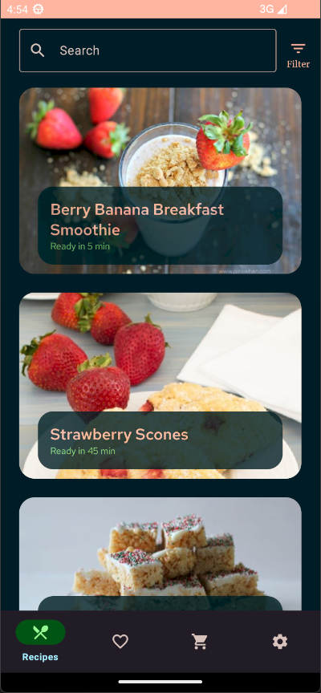 | 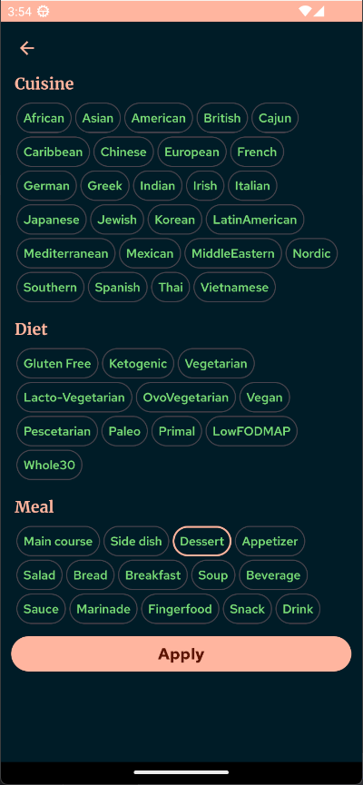 |

| Detail Screen | Detail Screen | Detail Screen |
| ------------- | ------------- | ------------- | 
| 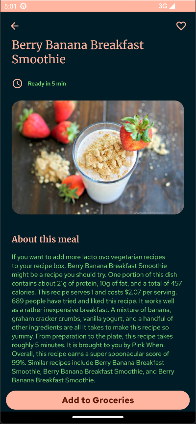 | 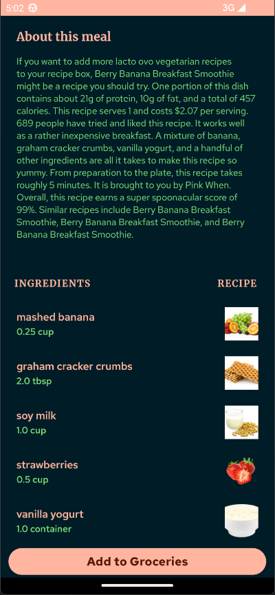 | 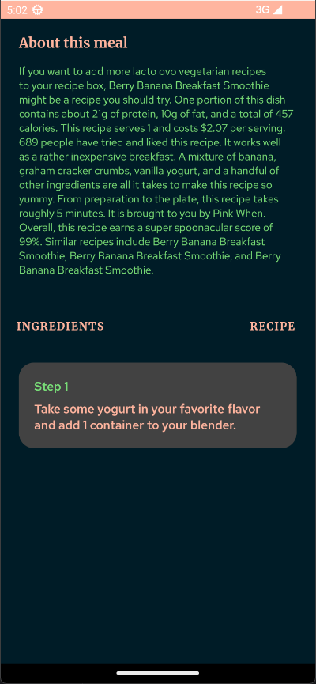 |

| Favorites Screen | Grocery Screen | Settings Screen |
| ------------- | ------------- | ------------- | 
| 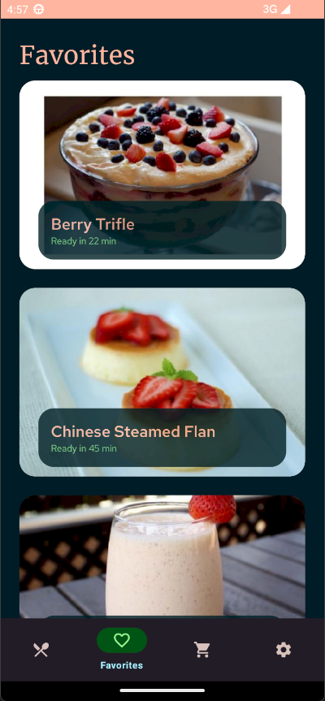 | 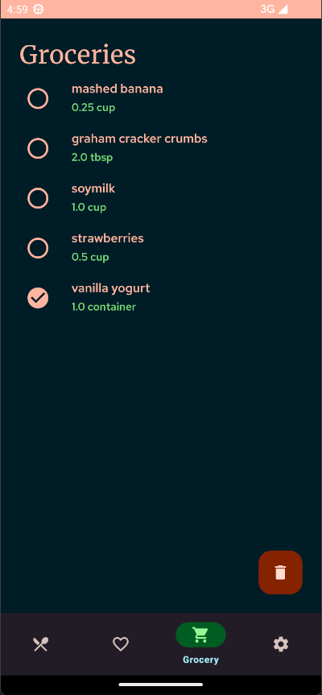 | 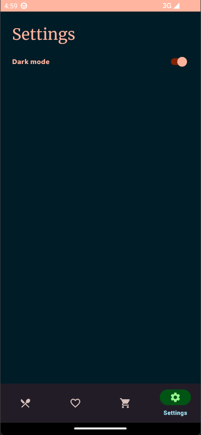 |

## Light Mode
| Splash Screen | Home Screen | Filter Screen |
| ------------- | ------------- | ------------- |
| 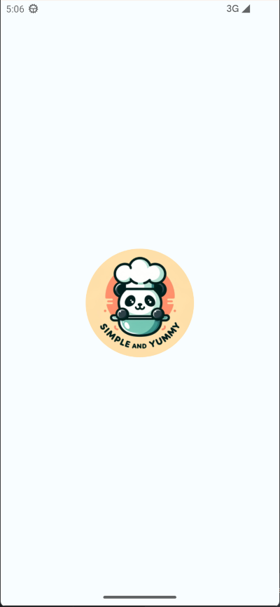 | 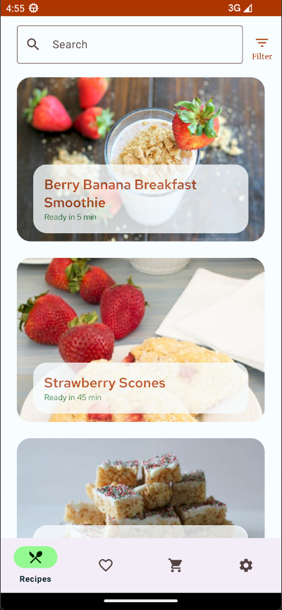 | 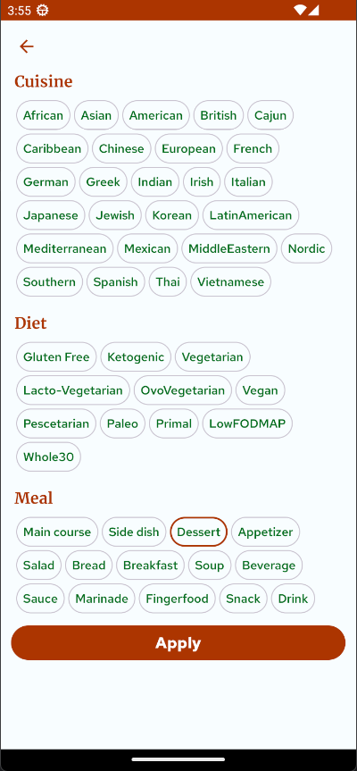 |

| Detail Screen | Detail Screen | Detail Screen |
| ------------- | ------------- | ------------- | 
| 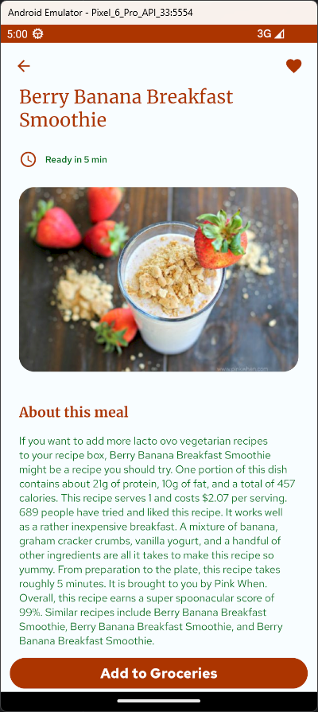 | 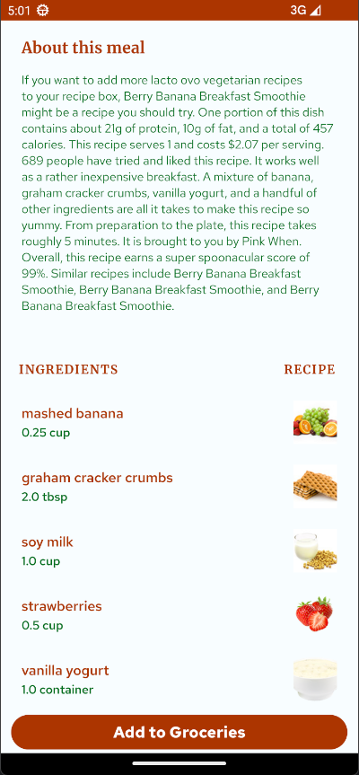 | 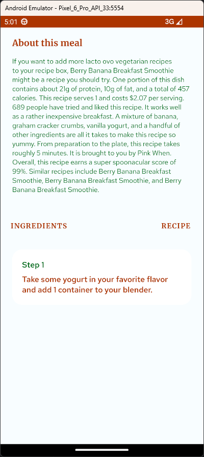 |

| Favorites Screen | Grocery Screen | Settings Screen |
| ------------- | ------------- | ------------- | 
| 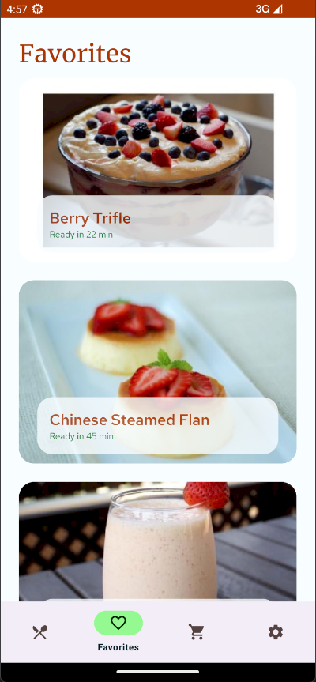 | 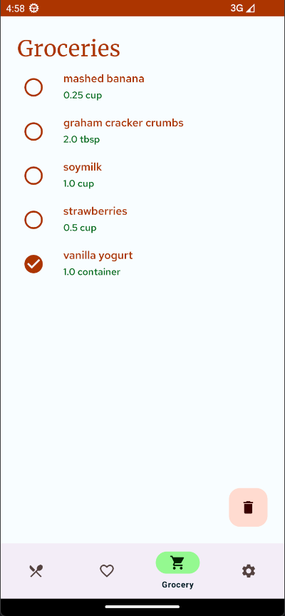 | 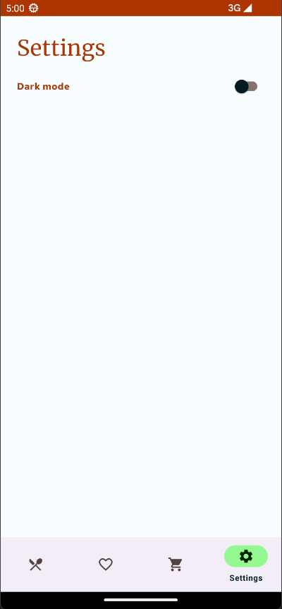 |

## Video

## Tech Stack & Open-Source Libraries
- **Minimum SDK Level:** 24
- **100% Kotlin Based:** Leveraging the power of [Kotlin](https://kotlinlang.org/) with [Coroutines](https://github.com/Kotlin/kotlinx.coroutines) and [Flow](https://developer.android.com/kotlin/flow) for asynchronous programming.

### Android Architecture Components
- **Single-Activity Architecture**
- **Lifecycle:** Reacting to lifecycle state changes for optimized app behavior.
- **ViewModel:** Storing UI-related data persistently across UI changes.
- **UseCases:** Implementing domain-layer logic situated between the UI and data layers.
- **Repository:** Hosting application data and business logic in the data layer.

### Dependency Injection
- [Android Hilt](https://developer.android.com/training/dependency-injection/hilt-android): A robust dependency injection library for seamless component management.

### Network Operations
- [Retrofit](https://square.github.io/retrofit/): A type-safe HTTP client for Android and Java.
- [Gson](https://github.com/google/gson): A library for JSON serialization/deserialization.
- [OkHttp](https://square.github.io/okhttp/): An efficient HTTP client for network requests.
- [Interceptor](https://square.github.io/okhttp/features/interceptors/): Managing and manipulating network requests.

### Data Libraries
- **Room Database:** [Room](https://developer.android.com/training/data-storage/room) for local data storage.
- **DataStore:** [DataStore](https://developer.android.com/topic/libraries/architecture/datastore) for storing key-value pairs.
- **Jsoup:** [Jsoup](https://jsoup.org/) for HTML parsing.

### UI Libraries
- **Glide:** [Glide](https://github.com/bumptech/glide) for efficient image loading.
- **ViewPager2:** [ViewPager2](https://developer.android.com/jetpack/androidx/releases/viewpager2) for handling swipe gestures and transitions between screens.
- **SwipeRefreshLayout:** [SwipeRefreshLayout](https://developer.android.com/jetpack/androidx/releases/swiperefreshlayout) for adding the ability to refresh content via swipe gestures.
- **Flex Box:** [Flexbox](https://github.com/google/flexbox-layout) for a powerful layout manager.
- **Navigation:** [Navigation Component](https://developer.android.com/guide/navigation): Android's navigation component for handling navigation between destinations in your app.

## Architecture
This app uses [***MVVM (Model View View-Model)***](https://developer.android.com/jetpack/docs/guide#recommended-app-arch) architecture
 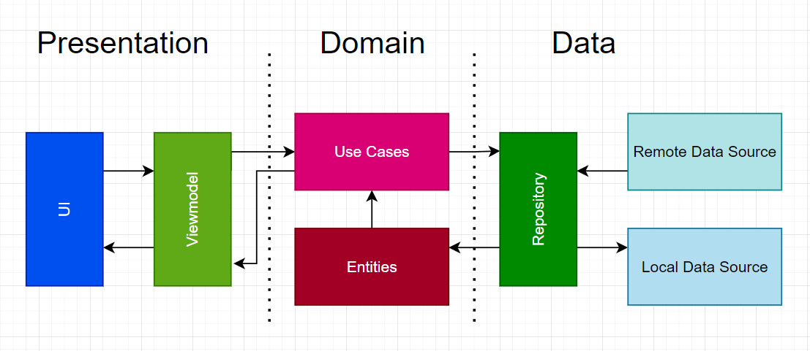

## API Key 🔑
- You will need to provide a private key to retrieve data from the [Spoonacular API](https://spoonacular.com/food-api/docs).

Add your API key to the `local.properties` file in your project:
API_KEY = YOUR_API_KEY

## Enjoyed this repository? 🐼 [follow me](https://github.com/karacloud1)

